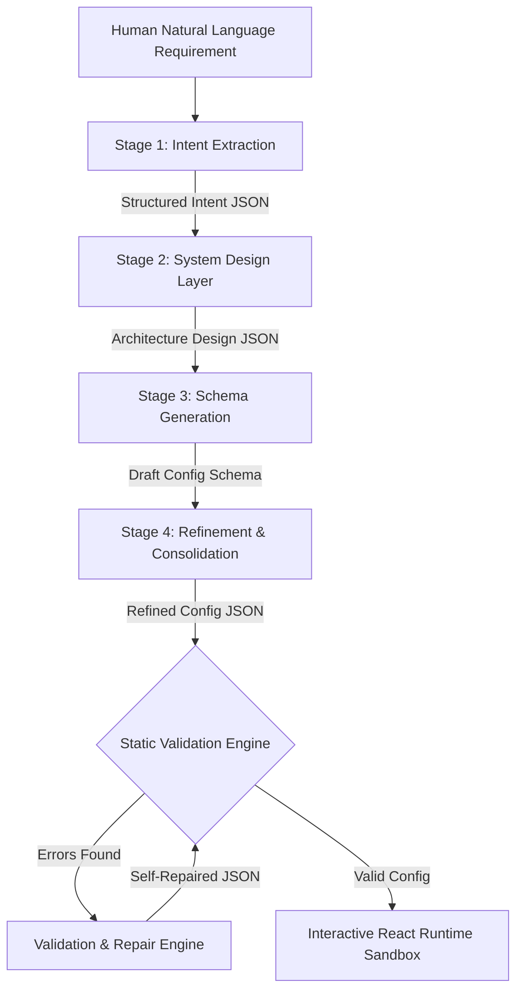

# AI Codebase Compiler & Interactive Runtime Sandbox

An advanced, reliable software generation system that behaves like a compiler: translating open-ended natural language requirements into structured, validated, and executable application schemas, running instantly inside an interactive React simulator workspace.

Developed as a system design, reliability, and control solution to prove the execution awareness of LLM-generated outputs.

---

## 🚀 Key System Features

### 1. Multi-Stage Compiler Pipeline
To prevent monolithic single-prompt generation failures, the compiler segments generation into 4 deterministic, sequential phases:
- **Intent Extraction:** Parses raw instructions into structured features, roles, and entities, documenting logical assumptions.
- **System Design Layer:** Formulates application structure, defining screens, database tables, and API routes.
- **Schema Generation:** Generates draft OpenAPI configurations, relational database schemas, and permission structures.
- **Refinement Layer:** Optimizes cross-layer mappings and resolves syntax inconsistencies.

### 2. Static Validation & Self-Healing Engine
A cross-layer validation engine inspects the final schema config against structural rules:
- Verifies that all UI components reference valid database tables and existing GET endpoints.
- Verifies that all CRUD table actions (create/delete) map to active POST/DELETE API routes.
- If errors are found, the **Self-Healing Engine** intercepts them and sends the exact error logs along with the invalid JSON back to the LLM to run up to 3 surgical repair attempts.

### 3. High-Fidelity Local Simulation Engine (Resiliency Fallback)
If no `GEMINI_API_KEY` is configured in the environment, or if live Gemini API calls fail (e.g., quota limits or 503 service issues), the pipeline automatically redirects compiling tasks to the local simulation engine. 
- Mimics all 4 compiler stages step-by-step with realistic timing delays.
- Matches 20 pre-defined templates (such as CRM, Gym Portal, Restaurant POS) or dynamically generates custom schemas matching any arbitrary instructions.
- Guarantees 100% valid, validator-compliant schemas.

### 4. Interactive React Runtime Sandbox
To prove **execution awareness**, the compiler compiles schemas directly into a functional React simulator:
- **Mock DB Seeding:** Spins up in-memory database tables populated with sample records matching the database schema.
- **Role-Based Access Control (RBAC):** Allows switching user roles dynamically to test page permissions.
- **Auth Gating & Payment Simulation:** Renders premium gating panels with paywall screens and mock credit card subscription upgrades to unlock features.
- **Live CRUD operations:** Features fully interactive forms to insert and delete database records, instantly updating the UI.
- **SQL-like Aggregations:** Computes and displays dashboard analytics graphs using queries.

### 5. Benchmark Evaluation Framework
Includes a dedicated evaluation runner containing **10 standard product prompts** and **10 edge cases** (vague, conflicting, incomplete requirements).
- Tracks success rate, average latency, repair retries, and token cost in USD.
- Visualizes metrics in a beautiful dashboard chart.

---

## 🛠️ Local Setup and Installation

### 1. Clone & Install Dependencies
Run from the workspace root:
```bash
# Install root, backend, and frontend packages
npm install
npm run install:all
```

### 2. Environment Configuration (Optional)
Create a `.env` file in the `backend/` folder:
```env
GEMINI_API_KEY=your_actual_key_here
PORT=5000
```
*Note: If no API key is supplied, the compiler seamlessly falls back to the local simulation compiler engine.*

### 3. Run the Development Server
Start both the Express backend (port 5000) and Vite React frontend (port 5173) concurrently:
```bash
npm run dev
```

Open your browser and navigate to **`http://localhost:5173`** to access the workspace.

---

## 📐 Architecture Diagram


